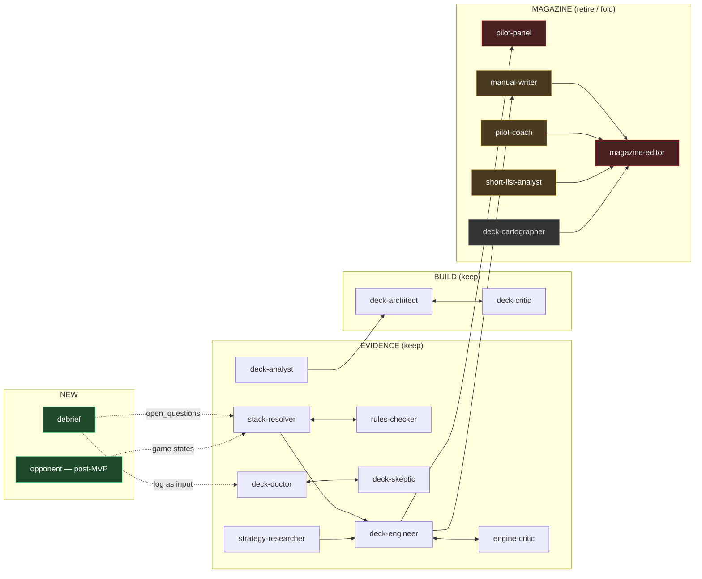

# Agent audit — 2026-08-19

*Input to the workbench pivot. Reads all 18 charters in `.claude/agents/` against the
new brief: a lab bench for one pilot's paper decks — versions, a captain's log, stats,
goldfish, and later a one-opponent T5 simulation. The magazine becomes a compact
technical manual rendered from the same artifacts.*

---

## Summary

Eighteen agents, four fates.

| Fate | Agents | What it means |
|---|---|---|
| **Keep, enrich** | stack-resolver, rules-checker, deck-doctor, deck-skeptic, deck-engineer, engine-critic, strategy-researcher, deck-analyst | The evidence layer. Every one writes an artifact a validator checks, and the validators survive the pivot untouched. Enrichment is about *inputs* (the log, a prompt, a game state), not about quality. |
| **Keep, unchanged** | deck-architect, deck-critic, pipeline-runner, viz-dev | Build loop + utilities. One stale number. |
| **Fold** | manual-writer + pilot-coach → one `pilot-notes` writer; short-list-analyst → deck-doctor | Two agents answer "what should I sleeve next" with different schemas; two agents write prose in five voices. One of each. |
| **Retire** | magazine-editor, pilot-panel, (deck-cartographer demoted to optional) | Pure packaging: ~350k tokens per deck of kickers, deks, cover violators, a three-way conversation, and city names. The pivot deletes the reason they exist. |
| **New** | `debrief` (captain's log → structured observations), later `opponent` (simulation) | The bridge from play to the lab does not exist yet. `pilot_feedback.md` — read by exactly one agent — is its only seed. |

The two largest findings are not about any one agent:

1. **~1,000 lines of identical boilerplate** are copy-pasted across 12 charters (the
   `deck-facts` preamble, the `--out` warning, *Returning your output*, *Partial revision
   mode*, L10). Every edit to that text MISSes every routine. Extract it once.
2. **L10 inverts.** "Every issue is the reader's first" is magazine law in six charters and
   one validator. The workbench *wants* history — versions, what changed, why, what happened
   in game four. It must be deleted from every agent, deliberately and in one pass.

Where the combat/interaction gap actually is: not in verification (the checker already
audits missing SBA and priority steps) but in **generation**. No agent can produce a
turn — combat steps, blocks, an opponent holding priority. The scenario schema has
opponents as `{life, board}`: static furniture. That is the structural gap, and it is a
schema problem before it is a prompt problem.

---

## The shape, before and after

Target: evidence agents write artifacts; `pilot-notes` writes the little prose a technical
manual needs; `debrief` turns your notes into inputs the evidence agents can consume; the
renderer is deterministic and there is no editor.

---

## Ordered list — every agent, with notes

Ordered by how much the workbench leans on them. Cost figures are from
`docs/agent-cost.md`.

### 1. `stack-resolver` — KEEP, ENRICH (the seed of simulation)

**What it is.** Resolves a fixed board + ordered stack top-down, every step cited
verbatim from the CR. `scenario-facts` preflight, scratchpad handoff, revision loop.
~35k/spawn.

**Strengths.** The citation contract is the best-enforced thing in the repo. The
scenario format is a spec now (hand as list, sacrificed-to-pay annotation,
`mana_available` symbols). It has overturned deck premises (goblin-storm 004, hapatra
001) — it earns its cost.

**Weaknesses.** It resolves a *stack*, not a *turn*. "Resolve the stack top-down" is the
whole procedural instruction; there is no vocabulary for combat steps (CR 506–511),
declared blockers, or an opponent who holds priority and responds. Opponents are
`{life, board}` — they cannot act. The single hardest question the workbench wants
answered ("what happens on T4 when the Dimir player has two open and I swing") is
outside its schema.

**Enrichment.** Two steps, schema first: (a) a `game_state` v2 that supersedes
`scenario` — seat list with hand/open mana/known cards, an explicit `phase`/`step`,
and an `actions` list the resolver can be asked to resolve in sequence; (b) a charter
section on resolving combat (attackers → blockers → damage → SBA) with the same
citation discipline. Do not touch the 49 existing artifacts; v2 is additive.

### 2. `rules-checker` — KEEP, UNCHANGED (best charter per token)

**What it is.** Adversarial verifier: every citation judged against the whole rule,
missing-steps audit (SBA, priority, triggers, replacement effects), sibling
comparability via `scenario-facts`. ~29k/spawn.

**Strengths.** Short, sharp, and it has been right on every pass that mattered. The
missing-steps audit is exactly the verification side a simulation needs and it is
already there.

**Weaknesses.** None structural. When the game-state schema lands, the missing-steps
list should name combat steps explicitly so the checker audits a turn the way it
audits a stack.

### 3. `deck-doctor` — KEEP, ENRICH (this is your "researcher analyst")

**What it is.** MODE recon (dated web reconnaissance → `deck_recon.json`) and MODE
diagnose (16 cited axes → verdicts, engine SPOFs, priced cuts, adds that `closes` a
named axis, `open_questions` routed to other loops). 200–300k with the skeptic.

**Strengths.** The longest charter and the most *earned* — the enumerate-the-set table
is seven real failures turned into a procedure, and `validate-diagnosis` re-derives
every figure. Cuts are priced, `orphans_stack` is computed, adds must move the axis
they name. This is already the swap recommender you described.

**Weaknesses.** It is **deterministic and read-only by charter** ("same inputs → same
diagnosis, no dates"), which is right for a diagnosis and wrong for a conversation.
There is no channel for *intent*: "I keep getting wrathed on T5", "I want this faster",
"the Orinda pod is three aggro decks". `pilot_feedback.md` is not in its inputs.

**Enrichment.** Add **MODE prescribe**: takes a prompt (free text, or a `debrief`
artifact, or both) and writes `prescription-<hash>.json` — same schema as the
diagnosis's `cut_candidates`/`add_candidates`, same validator, keyed in the cache by
the prompt hash so each *question* stays deterministic. Declare the captain's log as an
input. Do not loosen the superlative rules for it.

### 4. `deck-skeptic` — KEEP, UNCHANGED

Matches the doctor finding-for-finding: re-runs the audit, judges quotes against whole
sections, attacks every cut and add, closed status set. Extend its procedure by one
line when prescribe mode exists ("a prescription's adds answer the prompt's stated
problem or are `unjustified`").

### 5. `deck-engineer` / 6. `engine-critic` — KEEP, LIGHT EDIT

**What they are.** Eight closed stages, `lines[]` with nullable `verified_by`,
`map_disagreements`, `open_questions`, `proposed_goldfish_edits`; the critic reads each
cited stack and asks whether it *supports* the line rather than merely *names* the
cards. ~260k per pass.

**Strengths.** `engine.json` is the best "understanding" artifact in the repo and the
dashed/solid contract is the evidence contract made visible. The critic's findings
become mechanical checks (already happened once). The 1,800-char cap is measured.

**Weaknesses.** Both charters end by talking about "three columnists" and "a green
line in a magazine". Cosmetic, but a charter that frames its stakes in terms of a
product that no longer exists will be read literally by the next agent.

**Edit.** Reframe stakes as the evidence contract and the manual. Nothing else. Note:
this is the deck's *machine* and the simulation branch should be able to read
`stages[]` as the thing to test — worth keeping stable.

### 7. `strategy-researcher` — KEEP, TRIM

**What it is.** MODE research (web → `strategy.md`, the only agent with write access,
strictly scoped) and MODE consult (RAG-grounded frame: archetype, schools, engines,
`matchup_frames`, `candidate_missing_lines`). 80–130k.

**Strengths.** The strategy DB is a genuine second corpus beside the CR, and the
append-only id discipline has held. Consult mode's `candidate_missing_lines` feeds
resolve-stack.

**Weaknesses.** The consult schema is shaped for the magazine: `matchup_frames` is
hardwired to four archetypes for the coach's department; the charter carries L10 and
"prose seeds". The frame overlaps with `engine.json` on `engines` (both name the
deck's engines; the engineer's is verified, the frame's is theory) — one will be read
as the other.

**Enrichment.** Drop L10 and the prose-seed framing. Replace `matchup_frames` with a
free list keyed by *your pod's* archetypes (a debrief input). The 49 strategy-DB gaps
in PLAN §8 are the research backlog; aristocrats/sacrifice first.

### 8. `deck-analyst` — KEEP, RE-SCOPE ("search for winners")

**What it is.** Read-only over the card data; writes `candidate_pool.json` (20–40
per role bucket) for the build loop. **235k/spawn** — the most expensive single
routine.

**Strengths.** Data discipline is exact: positional indexes, `by_card` lookups,
synergy ≠ similarity, "absence of a role is not evidence of absence of function".

**Weaknesses.** Its output is *build-loop shaped* and its cost makes it unusable for
the ad-hoc search you want ("find me cards in Sultai that sacrifice for value and cost
≤3"). The charter also says it serves `manual-writer`, which is going.

**Enrichment.** Most of what you mean by "search for winners" should be **CLI, not
agent**: `pool-facts` and `card-value` exist; a `manamap pilot card-search` with role,
identity, cmc, oracle-regex and embedding-neighbour filters is deterministic and free.
Keep the analyst for the build pool; add a cheap **MODE query** that takes a
one-sentence question and returns ≤30 cards with evidence, capped by instruction at
a small read budget.

### 9. `deck-architect` / 10. `deck-critic` — KEEP, UNCHANGED

The build loop over a deterministic baseline; every ratio cited verbatim; the critic
re-runs the bracket engine. ~430k per build. Low priority for MVP (you build from a
box rarely). One cosmetic fix: both cite "Judge's Desk A-004" as the cautionary tale —
name the stack (`goblin-storm` 004) instead.

### 11. `short-list-analyst` — FOLD INTO deck-doctor

**What it is.** Ten cards worth knowing, from the whole pool, each with `closes`,
`natural_cut`, validated evidence. 76–115k.

**Why fold.** Its `ten[].closes / natural_cut / bracket_delta` is the doctor's
`add_candidates[].closes / natural_cut / bracket_delta` with a count of ten and a
ranking. Two agents, two validators (`validate_considering`, `validate_diagnosis`),
two schemas for one question. It is also the only charter that reads
`pilot_feedback.md` — which is the right instinct, attached to the wrong agent. Move
the "ranked ten, ownership is not a criterion, forward-looking half-step posture" rule
into prescribe mode and retire `considering.json` in favour of the prescription. Keep
`considering_art.json`'s off-deck image mechanism for whatever renders the list.

### 12. `pilot-coach` + 13. `manual-writer` — FOLD INTO ONE `pilot-notes`

**What they are.** Eight prose keys in `manual_prose.json` across three voices (Coach
/ Counselor / Ledger), plus decision scenarios and the tutor guide. ~100k together
plus 60–90k per tutor guide.

**What survives the pivot, by key.**

| key | owner | verdict |
|---|---|---|
| `how_it_wins` | writer | **keep** as `game_plan` — the one paragraph a pilot reads before game one |
| `mulligan` | writer | **keep** — practical, short |
| `combo_lines[id]` | writer | **keep** — 77–144 words each, the argued intro to a verified line |
| `card_roles` | writer | **drop** — redundant with role tags + `engine.json` stages |
| `mana_base` | writer | **drop** — narrates `mana_analysis.json`; print the numbers |
| `upgrades` | writer | **drop** — section opener for a retired department |
| `threat_assessment` | coach | **shrink** to "when you become the archenemy" — 2,500 cap already the brief |
| `matchups` | coach | **replace** with per-pod matchups from the debrief |
| `decisions/*.json` | coach | **keep** — What's Your Play is practice, the best coaching object in the set |
| `tutor_guide.json` | coach | **keep** — one wish per tutor, validated |

**Why fold.** Both charters spend half their length on keeping three voices apart —
the `very`/`every` lint, the Sunny ban list, the shuffle test — and the founder still
said it read as one voice. One agent, one technical second-person voice, five keys,
no bylines. That deletes the hardest instruction in either charter and the voice lint
with it.

### 14. `pilot-panel` — RETIRE

Editor's letter + three-columnist conversation, opening on a hot take. 134k. Pure
magazine. One idea worth salvaging as a *field* on `engine.json` or the manual: the
**hot take** — a counter-intuitive, evidence-carried, one-sentence claim about THIS
deck ("stop trying to cast your commander"). It is the kind of line a captain's log
produces naturally after game twenty; it does not need three people to say it.

### 15. `magazine-editor` — RETIRE

Cover, kickers, headlines, deks, violators, rhythm, `the-kill.features`, furniture.
113–147k. Everything it decides is packaging for a form you are leaving. The
simplified manual is rendered deterministically from artifacts with fixed headings.
`issue_plan.json` goes with it; `issue.json` stays (authored identity: title, date,
status).

### 16. `deck-cartographer` — DEMOTE TO OPTIONAL

Names the constellation's cities (`THE TRAPS`, `MANA ON LEGS`). 60–93k per deck. The
map is worth keeping — it is a good picture and the dossier draws it interactively —
but the deterministic fallback names are "honest" by the charter's own word. Stop
making names a `deck_status` stage; spawn it when you feel like it.

### 17. `pipeline-runner` — KEEP; one stale number

Says "13 steps"; there are 15 (`pipeline.STEPS`). Otherwise correct and cheap.

### 18. `viz-dev` — KEEP

Will carry the deck-viewer/notes UI. The charter is current (post-Plotly) and short.

---

## New agents

### `debrief` — the captain's log (MVP)

**Job.** You write free text after a game — what happened, how it felt, what you
learned. The agent reads it with the deck's current artifacts and writes a
*structured annotation* beside it: the deck version (git sha of `decklist.txt`),
opponent archetypes mentioned, cards that over/under-performed, decisions you
flagged, and `open_questions` routed exactly as the engineer's are (`resolve-stack` /
`diagnose` / `goldfish` / `research-strategy`).

**Rules it inherits.** Never rewrites your note (the note is authored, like
`issue.json`; the annotation is derived). Card names resolve against `cards.json`.
A claim about a line is `needs a stack scenario` unless a passing stack exists. No
superlatives without enumeration — same table as the doctor. It is the cheapest agent
in the set by design: one note, one small artifact, no graph reads.

**Why an agent at all.** The deterministic half (timestamp, sha, append) is CLI
(`deck-notes add`). The agent's value is turning "I felt mana-screwed three games
running" into a `goldfish` open question and "the Dimir player held up two every
turn" into a pod-archetype entry the doctor's prescribe mode can read.

### `opponent` — post-MVP, simulation branch

One seat, T1–T5, given a game state and an archetype, chooses actions. Needs the
game-state schema from (1) first. Not an MVP item; named here so the schema work is
done with it in mind.

---

## Cross-cutting observations

**1. Extract the boilerplate.** Five blocks are pasted into most charters:

| block | charters | lines |
|---|---|---|
| *Start here: deck-facts* | 12 | ~30 |
| *Write per-deck views with `--out`* | 7 | ~15 |
| *Returning your output* | 14 | ~18 |
| *Partial revision mode* | 7 | ~15 |
| *L10* | 6 | ~10 |

Put them in `.claude/agents/_shared.md` and open each charter with "Read `_shared.md`
first." `agent_cache` hashes the charter file, so `_shared.md` must be added to every
routine's inputs (one line in `AGENT_ROUTINES`) or a shared edit would silently not
invalidate. Do this edit **before** any `cache-record` pass, in the same commit as the
L10 removal — it MISSes everything exactly once.

**2. L10 is now wrong, and it is in seven places.** Six charters + `validate_issue`'s
lint. The pivot makes history a feature: the manual may say "since the 08-11 swaps",
the doctor may say "three logs name mana". Delete it deliberately; do not let it
linger as "optional".

**3. The validators are the product; the prose is the cost.** Every survivor writes
JSON a Python validator checks (`validate_stack`, `validate_diagnosis`,
`validate_engine`, `validate_build`, `validate_tutor_guide`). Every retiree writes
copy. That is the whole pivot in one sentence, and it means the retirements are safe:
no evidence is lost, only packaging.

**4. Determinism vs. dialogue.** All 18 are "same inputs → same output" so the cache
can key them. A workbench question is not. Resolution: prompted modes write to a new
artifact named by the prompt hash and declare the prompt as an input. Each *question*
stays deterministic; the set of questions grows.

**5. Where the combat gap really is.** Verification is ready (checker audits missing
steps). Goldfish now has one do-nothing opponent with real combat triggers. What is
missing is (a) a game-state schema richer than `{you, opponents:[{life, board}]}`,
(b) an actor, and (c) a resolver that can be asked to resolve a *turn*. (a) is MVP-
adjacent work because `debrief` and `deck-doctor prescribe` both want to name a seat's
archetype and open mana — design the schema once.

**6. The cost the pivot deletes vs. keeps, per deck.**

| | routines | tokens |
|---|---|---|
| deleted | issue-plan, panel-prose, writer-prose, coach-prose (most), the-ten, deck-map-names | ~470k |
| kept | strategic-frame, deck-engine, deck-diagnosis, stacks | ~600k + stacks |
| added | debrief (small), prescribe (≈ a diagnosis pass) | ~250k per question |

---

## Recommended order of work (Sprint 0)

1. **`_shared.md` + L10 removal**, one commit, before anything is recorded. Touches all
   18 files and `AGENT_ROUTINES`. Proves itself by `cache-status` going MISS fleet-wide
   with `changed` naming the charter.
2. **Retire** `magazine-editor`, `pilot-panel`; delete their routines and `issue_plan.json`
   from `deck_status.STAGES`. Demote `deck-cartographer` out of STAGES.
3. **Fold** `manual-writer` + `pilot-coach` → `pilot-notes` (five keys, one voice).
   Update `merge_prose.py` key ownership and `PROSE_KEY_DEPARTMENT`.
4. **New `debrief`** charter + `deck-notes` CLI (Sprint 2 depends on it).
5. **`deck-doctor` MODE prescribe**, declaring the log as an input; fold
   `short-list-analyst`'s ranked-ten rule into it; retire `considering.json`.
6. **Cosmetic**: engineer/critic "columnists" → evidence contract; architect/critic
   "Judge's Desk A-004" → stack id; analyst's `manual-writer` reference;
   pipeline-runner "13" → `pipeline.STEPS`.
7. **Schema only**: draft `game_state` v2 in `docs/pilot.md` beside the scenario spec.
   No resolver change yet — the simulation branch picks it up.
8. `deck-analyst` MODE query and `card-search` CLI when Sprint 3's workbench CLI lands.
